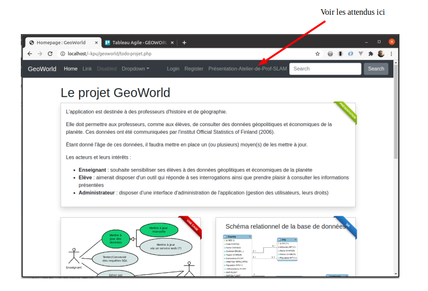

# Geoworld 


[source blender de l'image](https://www.blendernation.com/wp-content/uploads/2019/03/Ring_Of_Iron04_branded.png)

Projet pédagogique pour étudiant apprenti développeur.

### Prérequis :

* Base de PHP
* Base de SQL
* Base de HTML/CSS

Opérationnels sur votre machine :
* PHP
* MySQL
* git 
* un IDE 

### Prétention du projet

* Apprendre à travailler sur la base d'un existant simple
* Apprendre à respecter des conventions de codage
* Initier à une architecture 3 tiers Web simple
* Développer la créativité
* Un peu de méthodologie (user story, trello, phpcs, ...)

### Limite du projet 

* Pas d'usage de framework pour la structuration du projet 
* Pas de prise en compte de la sécurité au début du projet
* Pas une initiation au gestionnaire de version `git` non plus
* Pas de problématique de déploiement (à dockeriser ?)

Initié au lycée Léonard de Vinci - 77000 Melun

### Installation (tiers DB)

Dans le dossier `/doc` vous trouverez les scripts `MysSQL` pour créer le schéma de la base de données et un autre pour insérer des données.

1. Connexion à MySQL 
```
$ sudo mysql
```

ou 
```
$ mysql -u root
```

2. Création de la base de donnée
```
mysql> create database geoworld; 
```

3. Création d'un utilisateur

```
mysql> create user 'appuser'@'%' identified by 'ThePassword';
```

4. Définition des droits de l'utilisateur sur la base de données `geoworld`
```
mysql> grant all on geoworld.* to 'appuser'@'%';
```
Remarque : Les droits gagneraient à être moins large...

5. Test de connexion (le mot de passe doit être saisi en ligne de commande)
```
mysql> exit
$ mysql -u appuser geoworld -p
```

### Installation de l'application (tiers Application Backend)

Se placer dans un dossier de travail, ouvrir une console (terminal).

1. Installez l'application `geoworld` dans ce dossier.

```
$ git clone https://github.com/sio-melun/geoworld.git
```

2. se placer dans le nouveau dossier
```
$ cd geoworld
```

### Initialisation de la base de données  (tiers DB)

Se placer dans le dossier de l'application, ouvrir une console (terminal).

1. Création du schéma relationnel de la base de données (les tables)

```
$ sudo mysql geoworld < doc/world-schema.sql
```

ou

```
$ mysql -u root geoworld < doc/world-schema.sql
```

2. Insertion des données (lignes des tables)

```
$ sudo mysql geoworld < doc/world-data.sql
```
ou
```
$ mysql -u root geoworld < doc/world-data.sql
```


### Test de l'application (tiers Application backend)

Se placer dans le dossier de l'application, ouvrir une console (terminal).

1. Lancement de l'application
```
php -S localhost:8000
```

2. Connexion à l'application

À l'aide d'un navigateur, ouvrir l'URL : [localhost:8000](localhost:8000)


### Point d'entrée de l'application


